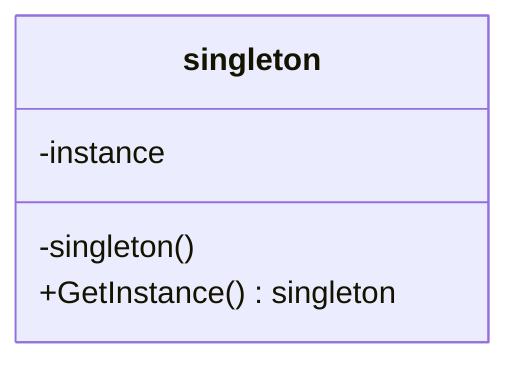

# Singletonパターン

## 説明
次を全て満たしたい場合に適用する。
- クラスのインスタンスが1つだけであることを保証する
- どこからでも同一のインスタンスにアクセスする
- 初回呼び出し時にインスタンスを初期化

上の条件を満たすには次の実装をすればよい。
- 外部のパッケージからオブジェクトのnewを禁止する
- 外部パッケージからインスタンス変数をstaticかつ非公開にする
- アクセスポイント提供用の関数を作る
    - インスタンスがなければここで生成

## 注意点
- 単一責任原則に違反
- マルチスレッド環境でsingletonを生成するには特別な処理が必要
- Singletonパターンを適用したクラスだけでなく、それを利用するクラスにおいても単体テストがし辛い

## 他パターンとの関係
- FacadeはしばしばSingletonに変換可能
- Abstruct Factories, Builders, PrototypesはSingletonで実装可能
- Flyweightで複数のオブジェクトの共有部分を1つのオブジェクトにしたらそれはSingletonに類似
    - Flyweightは単一であることを要求しない
    - Flyweightは不変